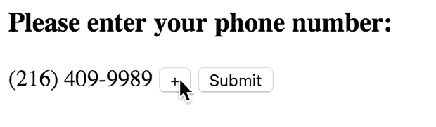
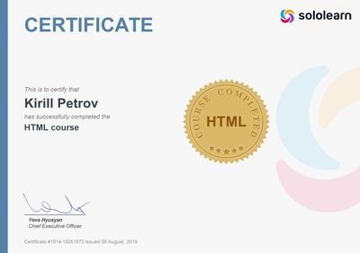
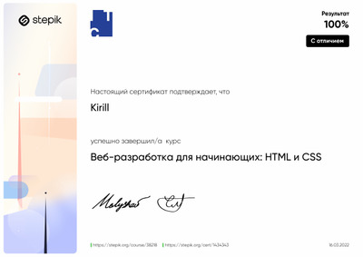
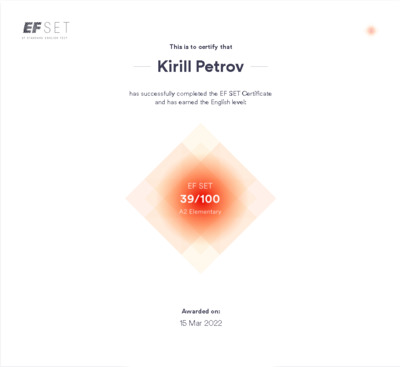

<!-- - 👋 Hi, I’m @kkk-petrov
- 👀 I’m interested in ...
- 🌱 I’m currently learning ...
- 💞️ I’m looking to collaborate on ...
- 📫 How to reach me ...
 -->
<!---
kkk-petrov/kkk-petrov is a ✨ special ✨ repository because its `README.md` (this file) appears on your GitHub profile.
You can click the Preview link to take a look at your changes.
--->


# Kirill Petrov

## Contact information

<!-- - Phone: ```+380 096 090 5928``` -->
- E-mail: ```kkpetrov.dev@gmail.com```
- Telegram: [@kk_ppetrov](https://t.me/kk_ppetrov/)
- LinkedIn: [Kirill Petrov](https://www.linkedin.com/in/kirill-petrov-5a72b622b/)


## Skills
- __HTML__
- __CSS (Bootstrap, BEM)__
- __Programming languages:__
  - __Python__
  - *JavaScript Basics*
  - *PHP Basics*
  - *C# Basics*
  - *C++ Basics* 
  - *SQL Basics*
- __Figma, Adobe XD, Adobe Photoshop__
- __Editors:__
  - __VS Code, Sublime Text__
  - *Visual Studio, PyCharm, WebStorm, Atom*

## Courses
- «HTML Fundamentals» on the [SoloLearn](sololearn.com) *(completed)*<br>

- «Веб-разработка для начинающих: HTML и CSS» on the [Stepik](stepik.org) *(completed)*<br>

- «Python Core» on the [SoloLearn](sololearn.com) *(in progress)*
- «Полное руководство по Python3» on the [Udemy](udemy.com) *(in progress)*

## Languages
- __Ukrainian *(Native language)*__
- __Russian *(Advanced)*__
- __English *(A2/B1, Intermediate)*__<br>

- __Czech *(Basic knowledge)*__
